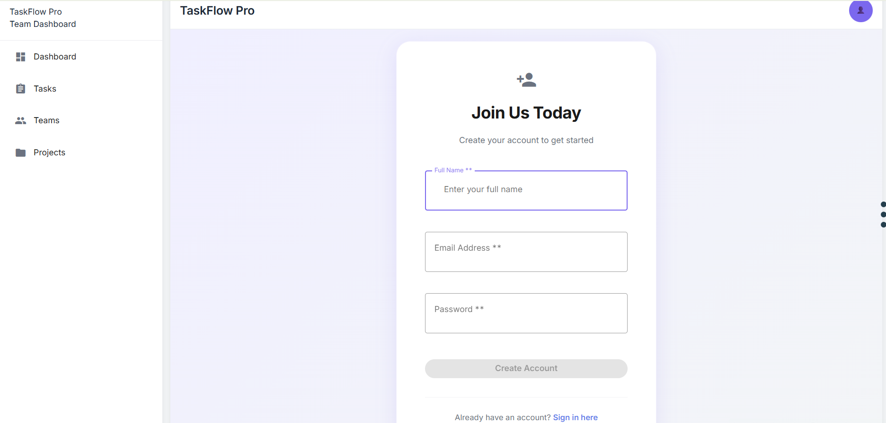
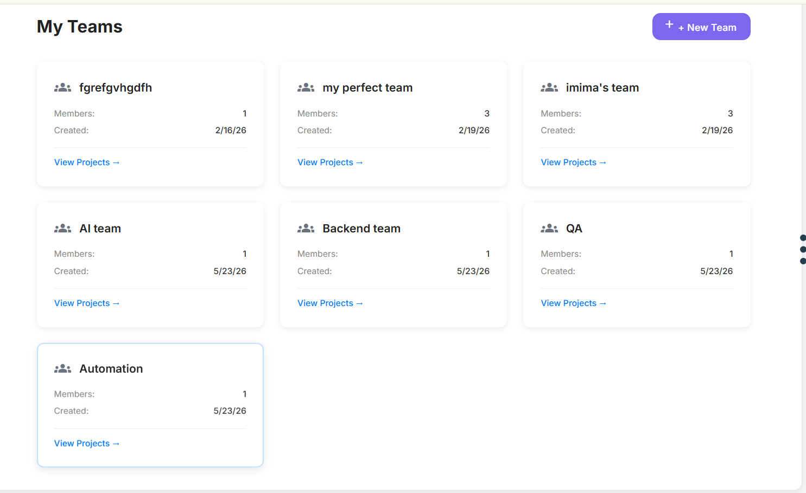
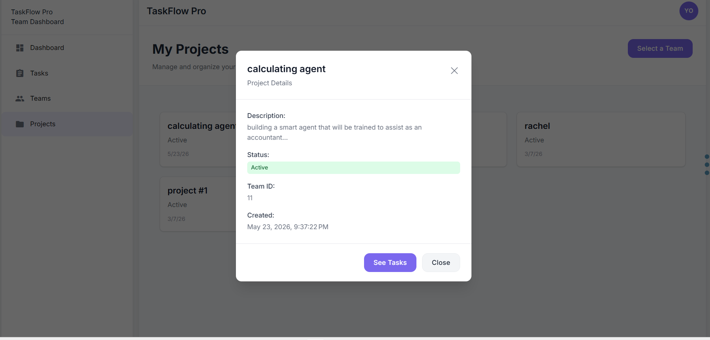
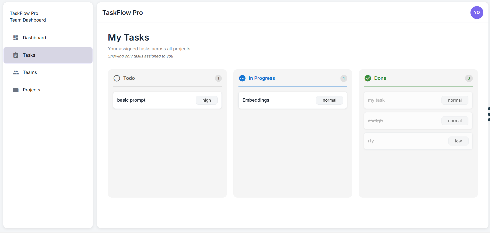
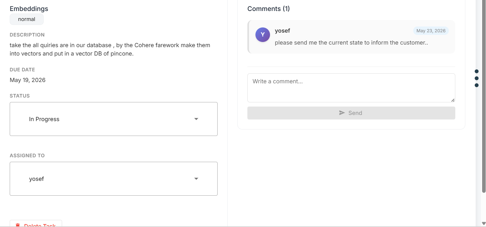

# TaskFlow Pro

A full-featured, team-based task management application built with **Angular 21**.  
Organize your team's work with projects, tasks, Kanban boards, and real-time comment threads — all in one place.

---

## Features at a Glance

| Area | What you can do |
|---|---|
| **Auth** | Register & log in with full validation, JWT session |
| **Teams** | Create teams, invite members, switch between teams |
| **Projects** | Create projects per team, view description & status |
| **Tasks** | Personal Kanban board across all projects |
| **Task Detail** | Edit status & assignee, discuss via comment thread |

---

## Tech Stack

- **Angular 21** — standalone components, signals, OnPush change detection
- **RxJS** — async data streams
- **SCSS** — component-scoped styles
- **Vitest** — unit testing
- **JWT** — stateless authentication via HTTP interceptor

---

## Getting Started

```bash
# Install dependencies
npm install

# Start the development server
ng serve
```

Open `http://localhost:4200/` in your browser.

```bash
# Production build
ng build

# Run unit tests
ng test
```

---

## Application Walkthrough

### 1 · Login & Register

The authentication screen handles both **login** and **account creation** from the same shared form component.  
Every field is fully validated before submission is allowed:

- **Full Name** — required, minimum length enforced
- **Email** — must be a valid email format
- **Password** — required, minimum security length

The submit button stays **disabled** until all validations pass, preventing bad requests from ever reaching the server.  
Existing users can switch to the login view via the *"Sign in here"* link at the bottom.



---

### 2 · My Teams

After logging in the user lands on the **Teams** screen — a bird's-eye view of every team they belong to.

Each team card shows:
- Team name
- Number of members
- Date created

From here the user can:
- **Create a new team** with the `+ New Team` button in the top-right corner
- **Navigate into a team's projects** via the `View Projects →` link on any card

Teams are the top-level organizational unit — all projects and tasks live inside a team.



---

### 3 · My Projects

Selecting a team opens the **Projects** screen, listing every project that belongs to that team.

Clicking a project card opens a **Project Details modal** that displays:
- Project name & description
- Current status (e.g., *Active*)
- Associated team
- Creation date and time

The modal's **"See Tasks"** button takes the user straight into that project's task board.



---

### 4 · My Tasks — Kanban Board

The **Tasks** screen is a personal Kanban board showing **every task assigned to the currently logged-in user**, across all projects and teams.

Tasks are grouped into three columns:

| Column | Meaning |
|---|---|
| **Todo** | Not yet started |
| **In Progress** | Actively being worked on |
| **Done** | Completed |

Each task card shows the task title and its **priority level** (high / normal / low), giving an instant overview of what needs attention most.



---

### 5 · Task Detail

Clicking any task opens the **Task Detail** page — the most powerful screen in the app.

**Left panel — task info:**
- Full task description
- Due date
- **Status dropdown** — the assignee can move the task between *Todo*, *In Progress*, and *Done* without leaving the page
- **Assigned To dropdown** — the task can be re-assigned to any team member directly from this view

**Right panel — comment thread:**
- A live comment section scoped to that specific task
- Team leaders can post questions or instructions directly on the task (e.g., *"please send me the current state to inform the customer"*)
- The assigned developer replies in the same thread, keeping all communication **in context** and traceable
- Every comment shows the author's name and the timestamp

This design eliminates the need for back-and-forth messages in external chat tools — everything about the task lives on the task itself.



---

## Project Structure

```
src/app/
├── core/
│   ├── services/       # ApiService, AuthService, TokenService, NotificationService
│   ├── interceptors/   # JWT auth interceptor
│   └── guards/         # Route auth guard
├── features/
│   ├── auth/           # Login & register forms
│   ├── teams/          # Teams list, team cards, add-member form
│   ├── projects/       # Projects list, project cards, detail modal
│   └── tasks/          # Kanban board, task detail, create-task modal
├── shared/
│   └── components/     # ActionButton, Notifications, UserMenu
└── layout/
    └── header/         # Global navigation header
```

---

## Useful Commands

```bash
ng generate component my-component   # Scaffold a new component
ng generate --help                   # List all available schematics
```

---

## References

- [Angular CLI Documentation](https://angular.dev/tools/cli)
- [Angular Signals Guide](https://angular.dev/guide/signals)
- [Vitest](https://vitest.dev/)
